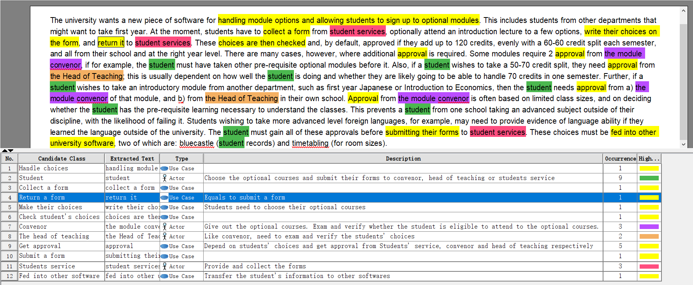
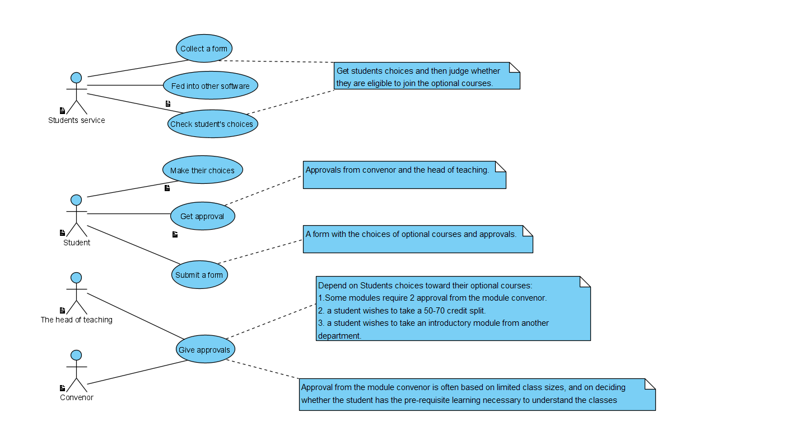

# Use Case Diagram
## Actor
---
### Student
---
Students is the primary stakeholder when choosing the optional courses. They need the software to make their choices, get approvals from the converors and the head of teaching,then submit their forms to students services.
### Convenor & Head of teaching
---
They will receive the requests from students who need approvals. They need the software to collect these information.
### Students Service
---
The provider of optional courses forms. They need the software to hand out the forms, receive the forms and verify students' application.

## Use Cases
---
- Collect forms.
- Get & Give approvals.
- Make choices.
- Submit forms.
- Check students' choices.
- Feed information into other softwares.

