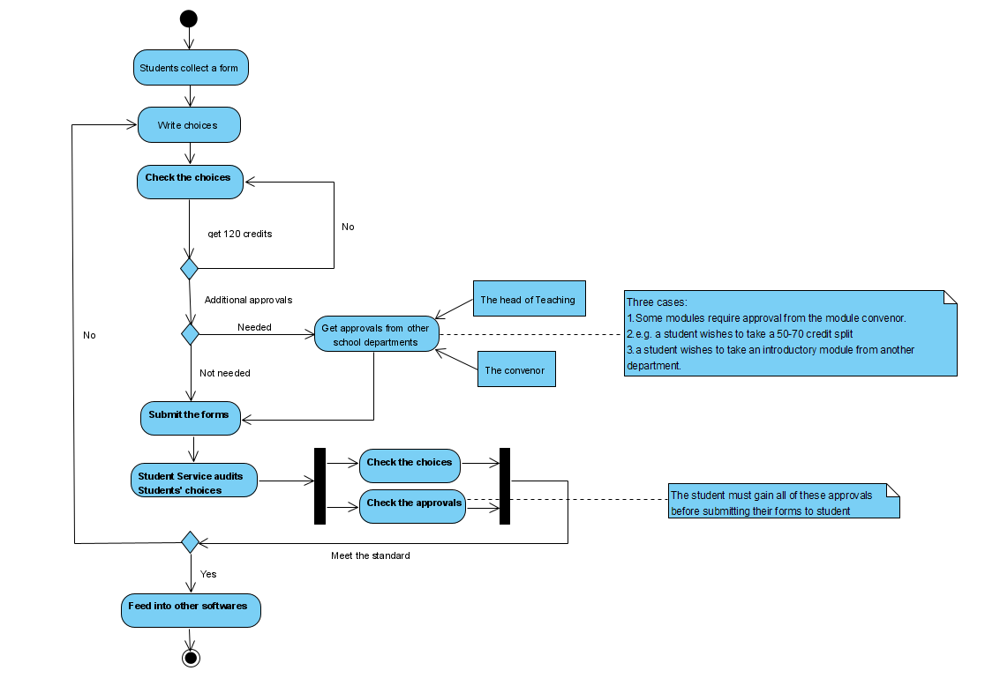

# Lab3: UML Diagram
## Introduction
---
The content belows is the analysis of the optional module selection software.
## Activity Diagram
---
The following diagram introduces the workflow of the optional modules application briefly. It simplifies several stages such as getting approvals from the head of teaching and the convenors. The notes beside the activities mention the relevant detailed cases. This diagram can make the workflow of the software more clear.

## Sequence Diagram
---
The following diagram shows four actors and the workflow among them. From this sequence diagrams, it is clear to see all the relationships and activities happened in the process of applying for optional modules. 

## Ending
---
Between these two diagrams, we pick the activity diagram due to its clear structure and full details. Compare with sequence diagram, we think more detailed information is needed for some cases like credits and different kinds of approvals and sequence diagram cannot meet this requirement. 